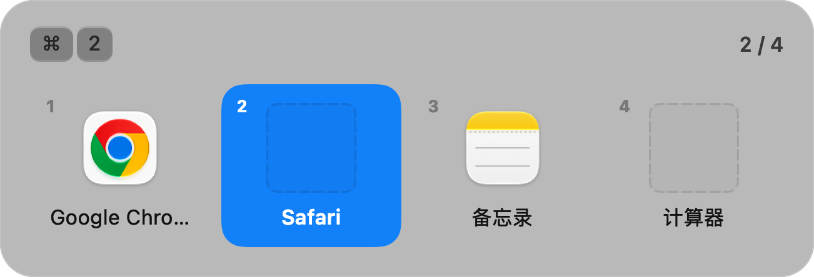
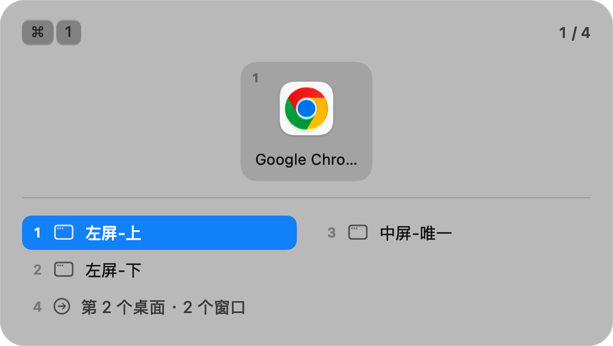
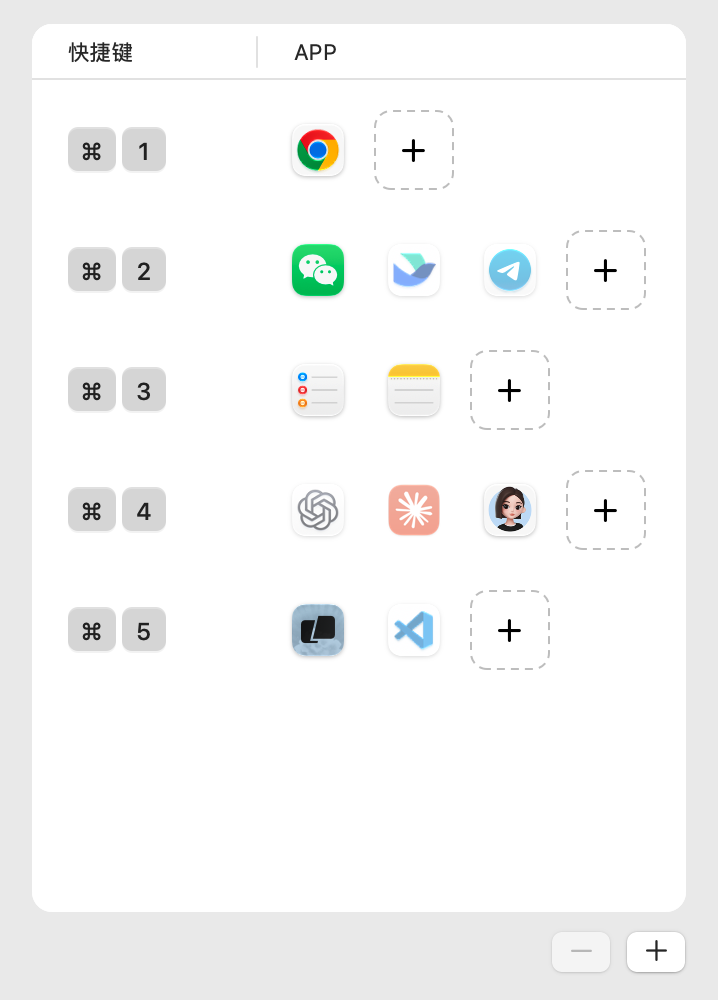

# Chord


**一个快捷键，唤出一组 app。**

Chord 是 macOS 菜单栏上的一个小工具。给每组常用的 app 配一个快捷键，按住修饰键按一下，
这一组就排成一行浮在屏幕中央；再按同一个键往后走，松开手就切过去。



## 它和 Cmd+Tab 有什么不一样

`Cmd+Tab` 按「最近用过」排序，位置一直在变；同一个 app 开了好几个窗口时还得反复按。
Chord 做的是**固定的工作台**，不是「最近使用」：

- 一个组 = 一类活儿：`⌘1` 浏览器、`⌘2` 聊天、`⌘3` 笔记、`⌘4` AI、`⌘5` 终端和编辑器……
- 组里的顺序**由你拖动决定，永远不会变**——按一下是第一个，按两下是第二个。
- 每组有自己的快捷键，不用先呼出一个总列表再挑。

## 用起来

按住修饰键、按组键；**再按同一个键往前走**，走到头绕回开头；松开修饰键就切过去。

| 操作 | 结果 |
|---|---|
| `⌘` 按住 + 按组键 | 唤出这一组，高亮第 1 个（此时还没切） |
| 再按同一个组键 | 往后走一个，到底了绕回开头 |
| `↓` | 展开当前 app 的所有窗口，继续按来选窗口 |
| `↑` | 回到 app 那一层 |
| 松开 `⌘` | **切过去** |
| `Esc` | 算了，不切 |

> 组里只有一个 app 时，按一下就列出它的窗口；那个 app 只有一个窗口时，
> 连浮层都不出现，直接就切过去了。

不只是当前桌面：别的桌面上的窗口、甚至窗口全关只剩菜单栏图标的 app，
Chord 也会把它们列出来并切过去。



## 安装

> ⚠️ 目前**还没有签名公证的安装包**，需要自己构建一次。三条命令，
> 前提是装好 Xcode 命令行工具（终端里跑 `xcode-select --install`）。

```sh
git clone https://github.com/hiauhong/chord.git
cd chord
Scripts/build-app.sh && open build/Chord.app
```

想放进「应用程序」文件夹也行（把 `build/Chord.app` 拖进去），但**之后别再挪它**——
「开机自启」记的是它的位置。

## 第一次运行：授权

macOS 不允许任何 app 在背后偷听键盘，所以第一次要你手动点一下：

1. 启动后，窗口里点「打开辅助功能设置」
2. 在列表里把 **Chord** 勾上（不在列表里就点 `+`，从「应用程序」里加进来）
3. 回到 Chord 的窗口——它会自己发现授权好了，然后切到配置界面

没授权也能打开，但**录不了快捷键**；这时菜单栏图标会带一个 ⚠️。

> 授权过还是没反应？把系统设置列表里的 Chord **删掉（−）再加一次**。
> 自己重新编译过之后，系统记住的旧签名就失效了。

## 配置



**每行是一组。**

左边点一下开始录快捷键：按下你想用的组合就录上了；松手之前按错了还能改（再按一个就替换）。

右边点 `+` 挑 app（可以一次多选），**拖动图标**调整顺序，**拖到别的行**就是换组。
左下角的 `−` / `+` 删掉或新建一组。

两条小规矩：

- 快捷键建议带上 `⌘`，别用光秃秃的单键——那会把普通打字吃掉。
- 一个组合只能属于一组。撞上了它会告诉你是第几组；**在同一个组合上连按两次，
  两组就对调了**。

配置存在 `~/Library/Application Support/Chord/groups.json`，就是普通 JSON，
可以手写、放进 dotfiles、或者直接备份：

```json
{
  "schemaVersion": 1,
  "groups": [
    {
      "id": "11111111-1111-1111-1111-111111111111",
      "shortcut": "cmd+4",
      "apps": [
        { "displayName": "Google Chrome", "path": "/Applications/Google Chrome.app" }
      ]
    }
  ]
}
```

`shortcut` 写成 `cmd+4` 这样：修饰键 `ctrl` / `alt` / `shift` / `cmd`（顺序无所谓），
最后跟一个键名——普通字符直接写（`4`、`k`、`/`），特殊键用 `space`、`tab`、`return`、
`escape`、`left`/`right`/`up`/`down`、`delete`。空字符串 `""` 表示还没绑。

## 开机自启

菜单栏图标 → 勾上「开机自启」。登录之后它会安静地待在菜单栏，**不会**弹窗口。

## 常见问题

**按了没反应？**
先看菜单栏图标有没有 ⚠️。有 → 权限还没给（见上面「授权」）。没有 → 多半是组合键
被别的 app 占了，换一个；也可能和某一组撞了，配置窗里会提示。

**想调整一组里 app 的顺序？**
配置窗里直接拖动图标。

**录快捷键录到一半不想录了？**
按 `Esc`，或者直接关掉配置窗——录制会跟着结束，不会留下什么。

**怎么彻底卸载？**
先取消「开机自启」，退出 Chord，删掉 `Chord.app`；想清干净就连
`~/Library/Application Support/Chord/` 一起删掉（配置和日志都在那儿）。

**自己改了代码怎么更新？**
`git pull` 之后重新跑一次 `Scripts/build-app.sh`，然后重新授权一次
（签名变了，系统里的旧授权记录会失效）。

## 排查

```sh
build/Chord.app/Contents/MacOS/Chord --status
```

打印 Chord 眼里的运行状态：权限到底有没有、最后一次切换走了哪条路、卡在什么地方。
比反复试快。

## 许可

MIT，见 [LICENSE](LICENSE)。

设计参考 [Thor](https://github.com/gbammc/Thor)（MIT, Alvin Zhu）：配置字段的形状、
快捷键字符串的写法，以及拖动排序的索引算法。本项目不 fork Thor，代码自行实现。

「这次是不是登录项拉起来的」用的是 Apple 的 [Launch Apple Event Constants] 里的
`keyAELaunchedAsLogInItem`。

> 这个项目是 **vibe coding** 出来的：架构、取舍与验收由人定，代码由人和 AI 结对写。
> 上面几张截图也是它自己渲染出来的（`--render-window` / `--render-hud`）。

[Launch Apple Event Constants]: https://developer.apple.com/documentation/coreservices/apple_events/1556410-launch_apple_event_constants
